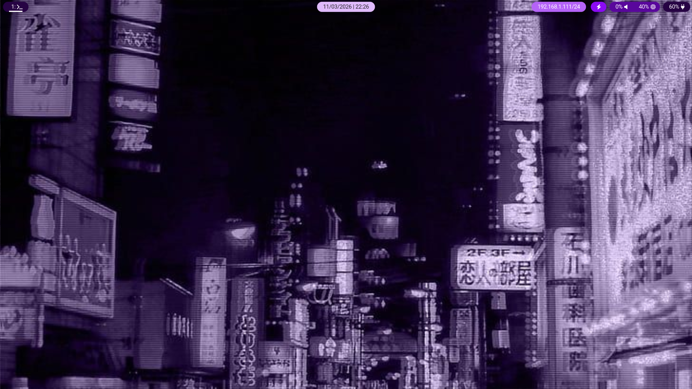

This is my main hyprland config based on purple-themed interface.  

## Preview

## Software used

 - Hyprland
 - Hyprlock
 - Waybar
 - Kitty
 - Rofi
 - eww (arch user repository)

## KeyBindings
    
    SUPER + W → Close active window
    SUPER + M → Exit session
    SUPER + R → Open app launcher
    SUPER + L → Lock screen
    SUPER + 1-9 → Switch to workspace 1-9
    SUPER + Shift + 1-9 → Move active window to workspace 1-9
    SUPER + RETURN → Open terminal emulator

## Credits
The hyprlock config files are based on the styles and config of [MrVivekRajan](https://github.com/MrVivekRajan/Hyprlock-Styles). 
I highly recommend to check out their work, as they created some beautiful hyprlock 
configurations.

Most configuration files are based on the default configs of each
program, with minimal modifications to achieve this setup.
